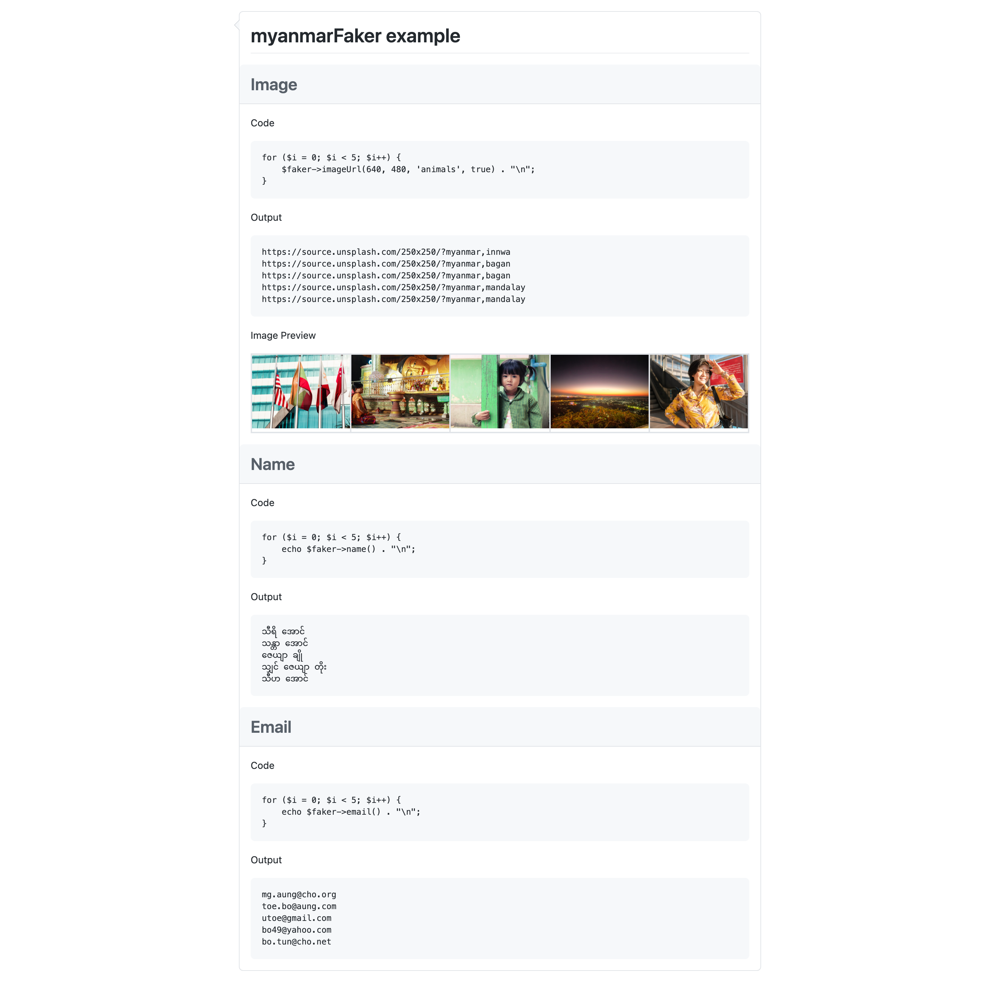

# myanmarFaker

Faker ဆိုတာက  Fake ဒေတာတွေ လုပ်ပေးတဲ့ PHP library ခပ်သေးသေးတစ်ခုပါ။ Database ထဲ ဒေတာ အကြမ်းတွေ၊ အစမ်းထည့်တာတို့ Data seeding  လုပ်တာတို့၊ XML ဖိုင်ကိုကြည့် ကောင်းအောင် Fake ဒေတာတွေနဲ့ လုပ်ကြံတာတို့၊ Rest API တွေကို Fake string တွေနဲ့ response ပြန်တဲ့အခါမျိုးမှာ အတော်အသုံးဝင်ပါတယ်။ Laravel မှာလည်း default ပါတာမို့ native PHP သမားတွေရော Laravel အတွက်ရော friendly ဖြစ်တဲ့ Package ဆိုလည်း ဟုတ်ပါတယ်။

ယခု  Project ကမူရင်း [FakerPHP/Faker](https://github.com/FakerPHP/Faker) ကို Fork လုပ်ထားတာပါ။

### Project Road Map

အခု myanmarFaker ရဲ့ဆက်ပြီးတော့ရေးသွားမယ့် Features တွေကို [Project road map](https://github.com/phyozawtun/myanmarFaker/projects/1) မှာဖော်ပြထားပါတယ်။

## Getting Started

### Installation

Faker requires PHP >= 7.1.

1. Clone the repo

```shell
git clone https://github.com/phyozawtun/myanmarFaker.git
```

2. Composer

```shell
composer install
```

3. Run in your browser and it should run like this.

```shell
myanmarFaker-example.php
```



### Documentation

လောလောဆယ် Full Documentation ကို [fakerphp.github.io](https://fakerphp.github.io) ကနေပဲ ကြည့်ပေးပါ။ နောက်မှ ပြည့်စုံတဲ့ Documentation ရေးထားပါမယ်။

### Basic Usage

အရင်ဆုံး `myanmarFaker\Factory::create()` ဆိုပြီး initialize လုပ်ဖို့လိုပါတယ်။ ပြီးနောက်ဖော်ပြပါအတိုင်း မြန်မာ စာကြမ်းတွေကို လိုချင်တဲ့ပုံစံအတိုင်း request လုပ်ပြီး တောင်းလို့ရပါတယ်။

```php
<?php
require_once 'vendor/autoload.php';

// use the factory to create a Faker\Generator instance
$faker = myanmarFaker\Factory::create();
// generate data by calling methods
echo $faker->name();
// သန္တာအောင်
echo $faker->email();
// toe.bo@aung.com.mm
echo $faker->imgae();
// https://source.unsplash.com/250x250/?myanmar,bagan
```


မူရင်း Faker Library မှာ `__call()` ဆိုတဲ့ PHP ရဲ့ Feature တစ်ခုကိုသုံးထားပါတယ်။ အဲ့တာကြောင့်  `$faker->name()` ဆိုပြီးခေါ်လိုက်တိုင်း မတူရဲ့ စာကြမ်းတွေကိုထုတ်ပေးနိုင်ပါတယ်။ ပိုသိချင်တယ်ဆို မူရင်း Project ရဲ့ [README.md](https://github.com/FakerPHP/Faker) မှာသွားလေ့လာဖို့အကြံပြုပါတယ်။

```php
<?php
for ($i = 0; $i < 3; $i++) {
    echo $faker->name() . "\n";
}
// သီရိအောင်
// သန္တာအောင်
// ဇေယျာချို
// သျှင်ဇေယျာတိုး
// သီဟအောင်
```

## License

Faker is released under the MIT License. See [`LICENSE`](LICENSE) for details.
